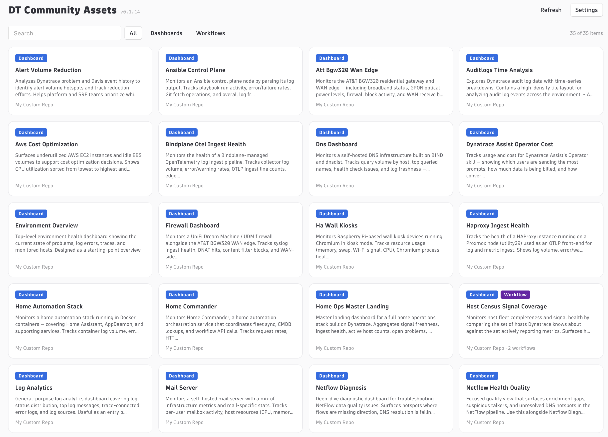
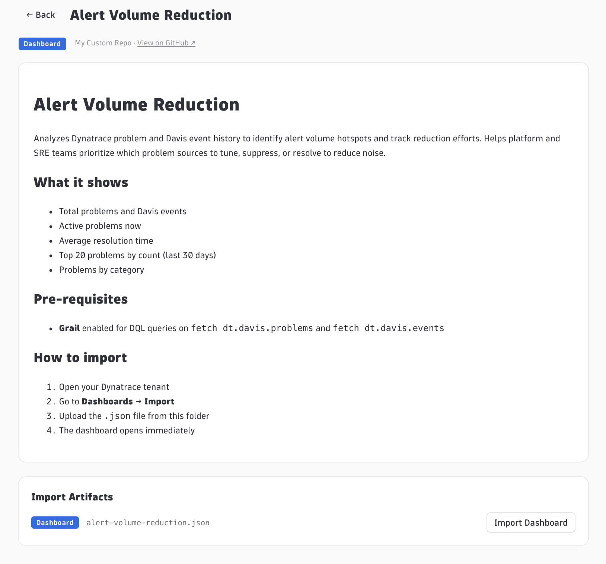

# DT Community Assets

A Dynatrace AppEngine app that browses public GitHub repositories for Dynatrace dashboards and workflows, and imports them into your tenant with a single click.





## Features

- **Browse multiple repos** — configure any number of public GitHub repositories as asset sources
- **Rich catalog** — each asset card shows a name, type badges (Dashboard / Workflow), and a description pulled from its `README.md`
- **One-click import** — dashboards import directly into your DT tenant via the Documents API
- **Workflow download** — workflows export as JSON for manual import (the `automation:workflows:write` scope is restricted to first-party DT apps)
- **Search and filter** — filter by type (Dashboards / Workflows) or search by name
- **PAT support** — configure a GitHub Personal Access Token to raise API rate limits

---

## Content repository layout

Any public GitHub repository can be added as an asset source, as long as it follows this structure:

```
<repo-root>/
├── my-first-dashboard/
│   ├── my-first-dashboard.json        # Dynatrace dashboard export (required)
│   └── README.md                      # Description shown in the hub (recommended)
├── host-monitoring-workflow/
│   ├── host-monitoring.workflow.json  # Dynatrace workflow export (required)
│   └── README.md
├── combined-asset/
│   ├── combined-asset.json            # Dashboard
│   ├── combined-asset.workflow.json   # Workflow
│   └── README.md
└── README.md                          # Repo-level readme (optional)
```

### Rules

| Rule | Detail |
|---|---|
| **One folder per asset** | Each top-level folder is treated as one catalog item |
| **Folder names** | Use `kebab-case`; displayed as title-cased names (e.g. `host-monitoring` → "Host Monitoring") |
| **Dashboard files** | Any `.json` file that does **not** end in `.workflow.json` |
| **Workflow files** | Any file ending in `.workflow.json` |
| **README.md** | Optional but strongly recommended — the first paragraph (up to 160 chars) appears on the catalog card; the full content renders on the detail page |
| **Ignored folders** | Folders with no `.json` or `.workflow.json` files are skipped |
| **Dot folders** | Folders starting with `.` (e.g. `.github`) are skipped |

### Exporting dashboards from Dynatrace

1. Open the dashboard in your DT tenant
2. Click the `⋮` menu → **Export** → **Export as JSON**
3. Save the file as `<slug>.json` in its folder

Workflows can be exported from the Workflows app via **Export** → **Download as JSON file**, then saved as `<slug>.workflow.json`.

---

## Adding a repository to the hub

1. Open the app and click **Settings**
2. Under **Add GitHub Repo**, fill in:
   - **Owner** — GitHub username or org (e.g. `jwl17330536`)
   - **Repo** — repository name (e.g. `dynatrace-standalone-dashboards`)
   - **Branch** — default branch (usually `main`)
   - **Label** *(optional)* — display name shown on cards instead of `owner/repo`
3. Click **Add Repo**
4. Navigate to the **Catalog** tab — assets load automatically

Multiple repositories can be added. Their assets appear together in the catalog.

---

## Importing assets

1. Click any card in the catalog to open its detail page
2. Review the README description, prerequisites, and file list
3. Click **Import Dashboard** next to a dashboard file — it imports into your tenant immediately and appears in your Dashboards list
4. For workflow files, click **Download JSON** and import manually via **Workflows → Import**

---

## GitHub Personal Access Token

The GitHub API allows **60 unauthenticated requests per hour** per IP. With 35 assets each requiring a README fetch, a single catalog refresh can use ~70 requests. A PAT raises this to **5,000 requests per hour**.

To add a PAT:

1. Go to [GitHub → Settings → Developer settings → Personal access tokens](https://github.com/settings/tokens)
2. Generate a **classic token** with no scopes (read-only access to public repos is the default)
3. In the hub app, go to **Settings → GitHub Personal Access Token**, paste the token, and click **Save**

The token is stored in `localStorage` in your browser and is never sent anywhere except the DT App Function proxy, which forwards it to the GitHub API.

---

## How it works

### Architecture

```
Browser (DT AppEngine)
    │
    ├── React UI (ui/)
    │     ├── Catalog page       — card grid, search, filter
    │     ├── Item detail page   — README + import buttons
    │     └── Settings page      — repo config + PAT (localStorage)
    │
    └── POST /api/github-proxy   ──▶  DT App Function (api/github-proxy.function.ts)
                                           │
                                           └── fetch() ──▶  api.github.com
                                                            raw.githubusercontent.com
```

### Why a proxy function?

Dynatrace AppEngine's Content Security Policy blocks browser `fetch()` calls to external domains — `connect-src` cannot be overridden in app config. All GitHub API calls go through a server-side DT App Function (`api/github-proxy.function.ts`) which is allowed to make outbound HTTP requests to allowlisted hosts.

The outbound allowlist (`builtin:dt-javascript-runtime.allowed-outbound-connections`) must include `*.github.com` and `*.githubusercontent.com`. On most DT tenants these are already present; check **Settings → App & Marketplace → JavaScript runtime** if catalog loading fails.

### Import mechanism

Dashboard import uses `@dynatrace-sdk/client-document` (`documentsClient.createDocument()`), which POSTs to `/platform/document/v1/documents` as multipart form-data. The app requires the `document:documents:write` scope.

---

## Development

### Prerequisites

- Node.js ≥ 16.13
- `dt-app` CLI (installed as a dev dependency)
- A Dynatrace tenant with AppEngine enabled

### Setup

```bash
git clone https://github.com/jwl17330536/dynatrace-community-assets-hub-app.git
cd dynatrace-community-assets-hub-app
npm install
```

Set your tenant URL in `app.config.json`:

```json
{
  "environmentUrl": "https://<your-env-id>.apps.dynatracelabs.com/"
}
```

### Deploy

```bash
npm run deploy
```

The app is available at `https://<your-env-id>.apps.dynatracelabs.com/ui/apps/my.dt.community.assets`.

### App structure

```
dynatrace-community-assets-hub-app/
├── api/
│   └── github-proxy.function.ts   # DT App Function — GitHub API proxy
├── ui/
│   ├── components/
│   │   ├── CatalogCard.tsx        # Card with name, badges, README summary
│   │   ├── ImportButton.tsx       # Import (dashboard) or Download (workflow)
│   │   └── TypeBadge.tsx          # Dashboard / Workflow pill badge
│   ├── hooks/
│   │   ├── useGitHubCatalog.ts    # Fetches and parses repo content via proxy
│   │   └── useRepoConfig.ts       # Repo list + PAT stored in localStorage
│   ├── pages/
│   │   ├── Catalog.tsx            # Main catalog page
│   │   ├── ItemDetail.tsx         # Asset detail page
│   │   └── Settings.tsx           # Repo config + PAT settings
│   └── types.ts                   # Shared TypeScript interfaces
├── app.config.json                # DT app identity, scopes, tenant URL
└── package.json
```

---

## Reference content repository

[dynatrace-standalone-dashboards](https://github.com/jwl17330536/dynatrace-standalone-dashboards) — 35 dashboards and workflows covering home lab, network, infrastructure, and Dynatrace platform observability. Add it to your hub to see the full catalog.
